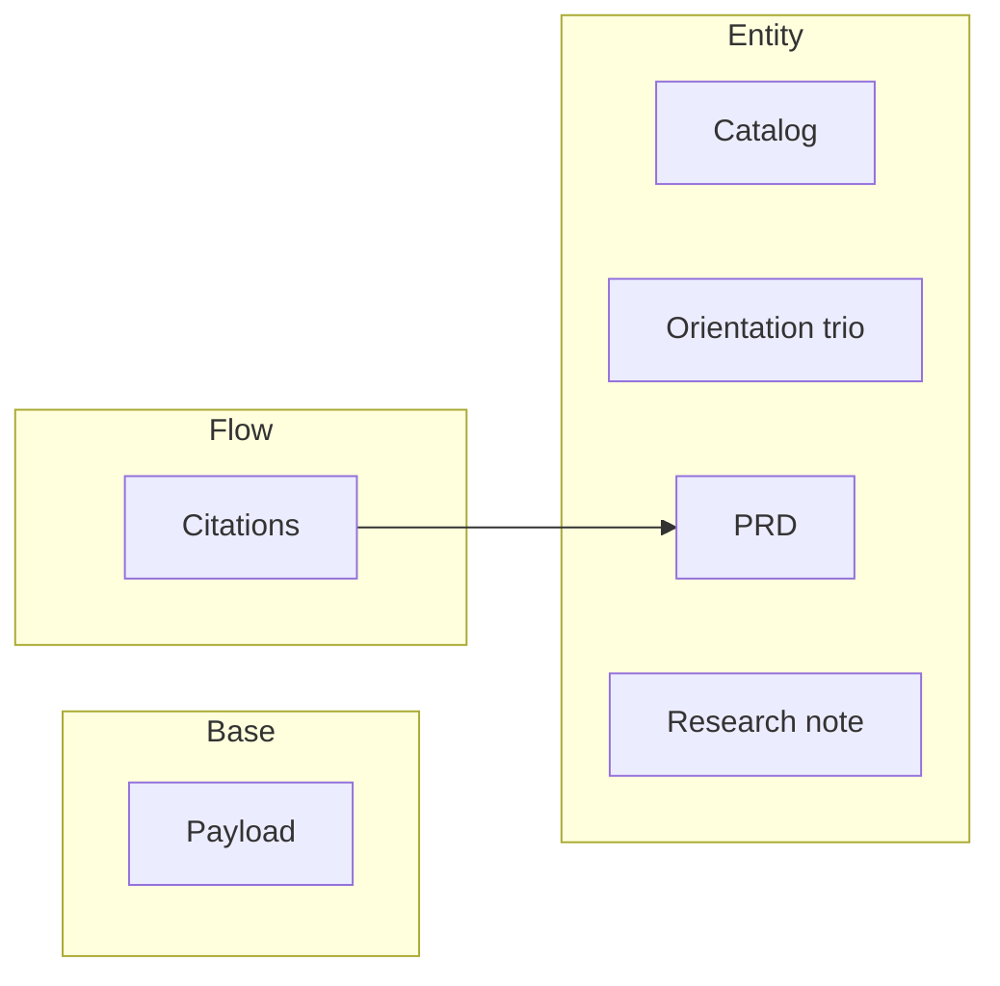

<!-- generated: python3 .knowledge/scripts/doc-lint --map --write .knowledge -->
# Product map

Every contract and proposal, in layer order, with how much of each a test proves.
**Generated — do not edit.** `doc-lint` fails the build when this file falls out of date.

**6 systems** — 6 ratified, 0 proposed. **33 requirements**, 33 proven by a test (100%).

## Base

| System | | Proven | Unproven |
|---|---|--:|--:|
| [Payload](./prd/base-payload.md) | `base-payload` | 3 |  |

## Entity

| System | | Proven | Unproven |
|---|---|--:|--:|
| [Catalog](./prd/entity-catalog.md) | `entity-catalog` | 4 |  |
| [Orientation trio](./prd/entity-orientation.md) | `entity-orientation` | 5 |  |
| [PRD](./prd/entity-prd.md) | `entity-prd` | 10 |  |
| [Research note](./prd/entity-research.md) | `entity-research` | 6 |  |

## Flow

| System | | Proven | Unproven |
|---|---|--:|--:|
| [Citations](./prd/flow-citations.md) | `flow-citations` | 5 |  |

## How it connects

