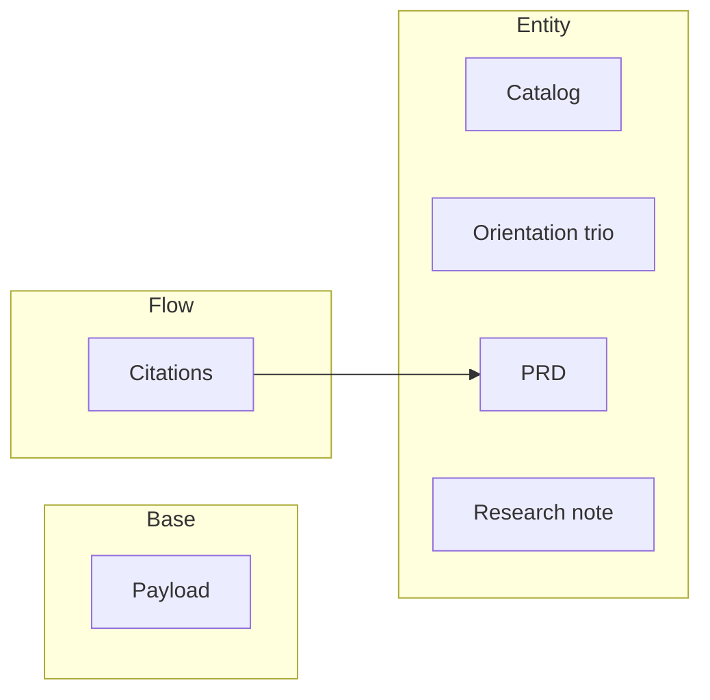

<!-- generated: python3 .knowledge/scripts/doc-lint --map --write .knowledge -->
# Product map

Every system we are building, in layer order — ratified contracts and open proposals.
**Generated — do not edit.** `doc-lint` fails the build when this file falls out of date.

**6 systems** — 6 ratified, 0 proposed.

## Base

| System | What it is |
|---|---|
| [Payload](./prd/base-payload.md) | The shipped `.knowledge/` tree itself: the set of homes and files every adopting repo receives and must keep |

## Entity

| System | What it is |
|---|---|
| [Catalog](./prd/entity-catalog.md) | The `README.md` at the head of each home: what is inside that home, and where the rule for writing it lives |
| [Orientation trio](./prd/entity-orientation.md) | The three always-loaded docs — brief, codemap, memory — that an agent reads at the start of every task |
| [PRD](./prd/entity-prd.md) | A ratified, test-backed contract for one built system, written as a table of identified requirements with a pass-or-fail glyph on each |
| [Research note](./prd/entity-research.md) | A dated report on how the world outside the codebase solved a problem, written so someone can decide something |

## Flow

| System | What it is |
|---|---|
| [Citations](./prd/flow-citations.md) | What emerges once contracts reference each other: a graph of requirement IDs |

## How it connects

