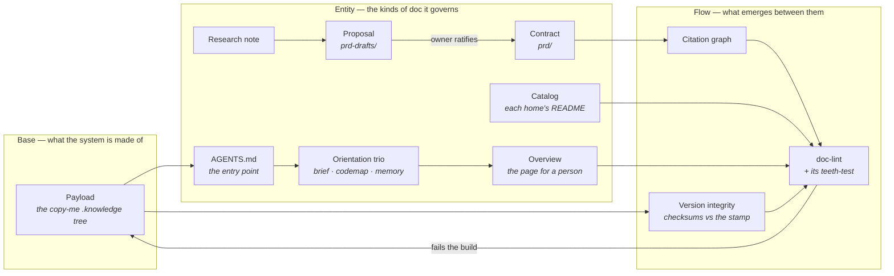

# Overview — knowledge-template

*This describes the system as designed. What is proven today is recorded row by row in the contracts —
[`prd/`](./prd/) for the ratified ones, [`prd-drafts/`](./prd-drafts/) for those still in proposal.*

## What this is

knowledge-template is a documentation system for codebases worked on by AI coding agents: it gives every
kind of knowledge one home, one writing standard, and a linter that fails the build when a doc drifts. It
is for the people who own those repos — the engineer adopting it, the agent writing under it, and the
stakeholder who reads the one page written for them. **It is not sold.** It is an internal standard,
published openly, and a repo adopts it by copying a directory.

## The platform

## How it works

- **Payload** — the copy-me `.knowledge/` tree a repo takes; its shape is itself a contract.
  [contract](./prd/base-payload.md)
- **AGENTS.md** — the repo's rulebook, and the only reason any of these docs get read.
  [contract](./prd/entity-orientation.md)
- **Orientation trio** — brief, codemap and memory load on every task and stay terse.
  [contract](./prd/entity-orientation.md)
- **Overview** — the one page written for a person rather than an agent, and the only one that leaves the
  building. [contract](./prd/entity-orientation.md)
- **Research note** — a dated note on how the world outside solved a problem; input, never truth.
  [contract](./prd/entity-research.md)
- **Proposal** — an idea enters as a draft, isolated: a contract may never cite one.
  [contract](./prd/entity-prd.md)
- **Contract** — the owner ratifies the file and it moves in unchanged; the glyph column records proof.
  [contract](./prd/entity-prd.md)
- **Catalog** — each home's README, listing what is actually in it, maintained by hand.
  [contract](./prd/entity-catalog.md)
- **Citation graph** — contracts reference each other's IDs instead of restating them, one way, no cycles.
  [contract](./prd/flow-citations.md)
- **Version integrity** — the shipped files are checksummed, so a repo can prove it runs the version it
  claims. [contract](./prd/base-payload.md)
- **doc-lint** — checks all of the above in CI and fails the build, which is what makes the standard
  executable rather than advisory. [contract](./prd/entity-prd.md)

## What you use

- **The repo owner** — copies one directory in, answers a few questions during adoption, and afterwards
  meets the system only when a build goes red.
- **The coding agent** — reads three short files on every task and pulls a writing standard only when it is
  about to write that kind of doc.
- **The stakeholder** — reads `OVERVIEW.md` and nothing else; it is written for them and needs no tooling.
- **The reviewer** — reads the contract rows, where a tick means a named test proves the claim.

## What governs it

- **One fact, one home** — every doc answers one question, and no fact is written in two places. Set by the
  model itself. See [`prd/base-payload.md`](./prd/base-payload.md).
- **Proposals stay isolated** — a ratified contract may never cite one, so the source of truth never rests
  on an unapproved claim. Set by the owner's ratification. See [`prd/flow-citations.md`](./prd/flow-citations.md).
- **A tick requires a named test** — proof is the glyph column, never the author's confidence. Set by the
  contract's own schema. See [`prd/entity-prd.md`](./prd/entity-prd.md).
- **The shipped files are never edited in place** — they are checksummed against the version stamp, so
  local drift fails the build instead of hiding. Set by the release. See
  [`prd/base-payload.md`](./prd/base-payload.md).
- **A rule is a check, a teeth-test, and a row** — prose alone is teaching, not law. Set by this repo's own
  rulebook. See [`prd/entity-prd.md`](./prd/entity-prd.md).

---
*Editing this file? Follow the standard first: [`guides/docs-overview.md`](./guides/docs-overview.md).*
