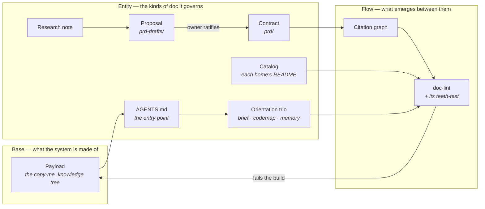

# Overview — knowledge-template

*Written for a person, not a linter: what the platform is made of and how a thing moves through it. Read
this to understand the system; read `prd/` to learn what any one part guarantees.*

## The platform

## How it works

1. **Payload** — a repo copies `template/.knowledge/` into its root. That tree is the substrate every other
   rule assumes, so its shape is itself a contract. See [`prd/base-payload.md`](./prd/base-payload.md).
2. **AGENTS.md** — the repo's root rulebook is the only reason any of these docs get read: it names the
   orientation trio, and nothing below it is reachable without that. See
   [`prd/entity-orientation.md`](./prd/entity-orientation.md).
3. **Orientation trio** — brief, codemap and memory load on every task and stay terse. Each ends with a
   pointer to its own standard, so an agent about to edit one reads the rules first.
4. **Research** — a dated note reports how the world outside solved a problem, sourced at the point of
   claim. It is input, never truth. See [`prd/entity-research.md`](./prd/entity-research.md).
5. **Proposal** — an idea enters as a draft in `prd-drafts/`, isolated: a ratified contract may never cite
   one. See [`prd/entity-prd.md`](./prd/entity-prd.md).
6. **Contract** — the owner ratifies the file and it moves into `prd/` unchanged. Approval moves it; the
   glyph column, not the move, records what a test proves.
7. **Citation graph** — contracts reference each other's IDs instead of restating them, one way only, no
   cycles. That graph is what stops the same fact living in three files. See
   [`prd/flow-citations.md`](./prd/flow-citations.md).
8. **doc-lint** — checks all of the above in CI and fails the build on a broken doc, which is what makes
   the standard executable rather than advisory. Its teeth-test proves each rule still bites.

## The pieces

**Base**
- [Payload](./prd/base-payload.md) — the shipped homes and files; every directory present, nothing stray at the root.

**Entity**
- [Orientation trio](./prd/entity-orientation.md) — brief, codemap, memory, plus the rulebook that loads them.
- [Catalog](./prd/entity-catalog.md) — each home's `README.md`: what it holds, and the standard for writing it.
- [PRD](./prd/entity-prd.md) — the contracts: namespaces, the word cap, evidence, the closed schema.
- [Research note](./prd/entity-research.md) — dated, schema-closed, every source linked and cited.

**Flow**
- [Citations](./prd/flow-citations.md) — IDs unique, resolving, one-way up the layers, no cycles.

**Tooling** — `scripts/doc-lint` and `scripts/test_doc_lint.py` ship inside the payload, so every adopting
repo enforces the same rules with nothing installed.

---
*Editing this file? Follow the standard first: [`guides/docs-overview.md`](./guides/docs-overview.md).*
