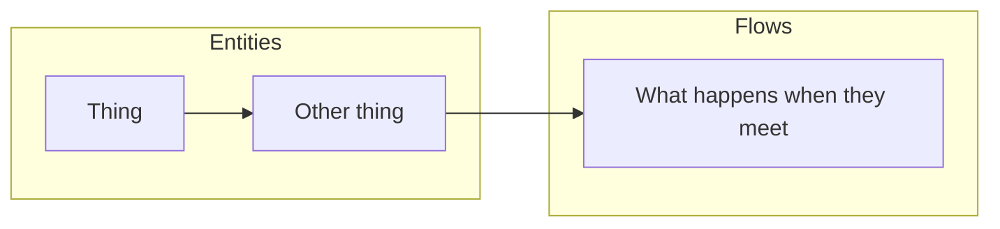

# How to write an OVERVIEW — the standard

This guide **is the standard** for `../OVERVIEW.md`. Shipped and versioned by `knowledge-template`.
**The template is `../OVERVIEW.md` itself** — start from it and fill each section.

`OVERVIEW.md` is **the one doc written for a stakeholder**. Everything else in `.knowledge/` serves an
agent: `BRIEF.md` orients, `CODEMAP.md` locates, `prd/` contracts. None of them ever shows the platform.

**Write it as if a product owner is reading it to understand the product they are about to sell.** It
answers what the parts are, how work flows between them, and what governs it. Someone should finish it able
to explain the product in a meeting without ever having opened the code.

**Only what a customer could buy or touch.** No environments, no test strategy, no deployment, no internal
tooling — none of that is the product. An admin surface counts if it is part of the offering people
actually use. If a line would not survive being read aloud to a prospect, cut it.

**Where an internal-sounding mechanism has a customer-facing consequence, name the consequence.** A new
seller being held in a sandbox is engineering's word for it; what a prospect needs to know is that *new
sellers cannot bill or deliver until they are approved*. Same rule, and only one of the two belongs here.

## Who it is for

**A product manager, a founder, a marketer, a new joiner on their first day — not a developer.** Assume the
reader has never opened the repo, will never open the repo, and stopped reading at the first word they
didn't recognise. Every other doc here is for an engineer or an agent; this one is not, and writing it in
engineering vocabulary wastes the only artefact those readers have.

**Use the words the business uses with its customers.** If a term appears in a sales conversation, a
pricing page or a support ticket, it belongs here. If it only appears in code, a protocol spec, or an
architecture discussion, replace it with what it *means* to someone using the product.

```
✅ Delivery — the buyer receives the lead in their own system, and we record whether it arrived
❌ FORM_POST delivery — posts the lead payload to the buyer's configured CRM endpoint

✅ Price quote — a price we have offered, good for a short window before it expires
❌ Bid TTL envelope — a signed bid token with an expiry claim, required on post
```

Banned outright: file names, class and table names, HTTP verbs and status codes, protocol names, and any
acronym the business does not say out loud. Link the contract for anyone who wants the mechanism —
**the link is where technical detail lives, never the sentence.**

The test before you ship it: **could someone in marketing read this aloud on a customer call without
stopping to ask what a word means?** If not, it isn't finished.

**It is written, not generated.** A tool can list what exists and draw the links it finds; it cannot decide
what matters, what to leave out, or what to call things so a newcomer follows. That judgement is the entire
value here. **Distil — do not dump.**

**Public and PII-free.** Assume a stranger reads it: no names, credentials, or machine paths.

## The diagram is the point

Everything else supports it. Rules, in order of how often they're broken:

- **Group by component.** Use one `subgraph` per layer the project declared in
  [`../prd/README.md`](../prd/README.md), in that order. The reader should see the system break into its
  levels before reading a single label.
- **About fifteen boxes, hard.** Past that nobody reads it and nobody maintains it. If the platform has
  forty parts, the diagram shows the fifteen that decide how it behaves — the rest live in
  [`../prd/README.md`](../prd/README.md), which lists everything by design.
- **One box = one thing a *non-technical* person would name.** If a stakeholder has never said the word out
  loud, it is implementation: rename it to what it does for the business, or leave it out.
- **Arrows are the point, not decoration.** An arrow means something real moves or depends: a request, a
  record, an authorisation. A diagram of boxes with no arrows has said nothing — if you cannot draw the
  arrows, you do not yet understand the platform, and that is worth saying out loud.
- **Point at the evidence for every arrow before you draw it** — the requirement, the field, the code path
  that makes it true. **A plausible arrow is the most dangerous thing in this file:** a reader builds their
  mental model from the picture and will never re-check it, and unlike a wrong sentence nobody proofreads a
  wrong line. If two things merely *appear* related, leave the arrow out and ask.
- **No status in the diagram.** No suffixes, no dashed nodes, no styling for what does or doesn't exist
  yet. The diagram answers one question — what the platform is and how work moves through it.
- **Label in the product's words**, matching each contract's `name:`, so a reader can jump from a box to
  the contract that governs it.



## Section guidance

- **`The platform`** — the diagram, and nothing else. No prose above it; it should survive being screenshotted.
- **`How it works`** — every component in flow order, **one short line each — about fifteen words**: what
  it is, and what it hands on. The whole list should be scannable in under a minute. Long paragraphs are the most common
  failure here — a product owner skims this section, and a wall of prose gets skipped entirely. The
  component is the unit: not a user story, not a sequence of API calls, the business naming its own parts.

  ```
  ✅ Source — where a seller's leads come from; feeds the lanes that price them.
  ❌ Source — where a seller's leads come from. A seller registers one; it starts in a safe sandbox
     until it is cleared for live traffic, and once live it feeds the lanes that price its leads.
  ❌ The Source entity is provisioned in sandbox mode and validated against the ping taxonomy.
  ```

  The first is scannable. The second says more and communicates less, and drags in a sandbox, which is not
  the product. The third is written for the wrong reader entirely.
- **No build status anywhere in this file.** Not in the diagram, not in the list, not as an aside. Whether
  something exists yet is the contracts' job — their glyph rows carry it, and where a contract lives says
  the rest. Status written here is stale the week after, and it is not what this document is for.
- **`What governs it`** — the rules that constrain the journey, and **who sets each one**: the terms both
  sides agreed, the limits, the obligations that pause things when unmet. A stakeholder can watch a demo
  and learn the flow; they cannot see the governance, which is exactly why it is here.

## Keeping it true

- **Update it when the shape changes** — a new system, a system removed, a flow re-routed. Not when a
  requirement changes; that is the contract's job, and this file never restates a requirement.
- **Never copy requirement text here.** Link the contract instead. Copied rules go stale silently, and this
  file is the one place nobody thinks to re-check.
- **If it disagrees with `prd/`, `prd/` wins** — and fix this file in the same task.
- **Where the content comes from:** the contracts in `prd/` and `prd-drafts/` (each one's *What this is*),
  the components declared in `../prd/README.md`, and `CODEMAP.md` for what actually exists. Where those
  leave the ordering ambiguous — and they usually do — **ask the owner rather than guessing a flow.**
