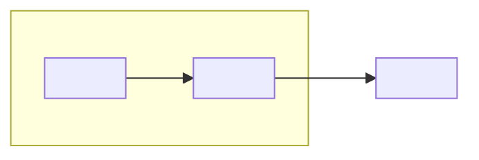

# Overview — <project>

*The platform in plain language — written for product, marketing and anyone new, not for developers. What
the parts are and how something moves through them. Follow a link to learn what a part guarantees.*

*This describes the platform as designed. What is proven today is recorded row by row in the contracts —
[`prd/`](./prd/) for the ratified ones, [`prd-drafts/`](./prd-drafts/) for those still in proposal.*

## What this is

<Three sentences, no more. What the product is, who it is for, and how it makes money. A reader who has
never heard of it should be able to repeat this back after one read — everything below assumes it.>

<If the commercial model isn't settled, say so in a line rather than inventing one.>

## The platform

<A diagram of the real shape of the system — the parts a person would name, and what flows between them.
Draw what matters, not everything: if a box has no bearing on how the platform behaves, leave it out.>

## How it works

<Every component on the diagram, in the order things flow through them. **One short line each** — what it
is and what it hands on. A reader should scan the whole list in under a minute and understand the flow.
Link each to its contract.>

- **<Component>** — <what it is, in a dozen words>. [contract](./prd/<file>.md)

## What you use

<One line per audience: the surface they touch and what they do there. Someone who owns nothing else should
finish this able to picture using the product. Name an audience that touches nothing, too.>

- **<Audience>** — <the surface they use, and what they do there>.

## What governs it

<The rules that decide what is allowed to happen, and who sets them — the terms both sides agreed, the
limits, the obligations that pause things when unmet. A stakeholder can watch a demo and learn the flow;
they cannot see the governance, which is why it is written here. One line each, linked.>

- **<The rule>** — <who sets it, and what it prevents>. See [`prd/<file>.md`](./prd/<file>.md).

---
*Editing this file? Follow the standard first: [`guides/docs-overview.md`](./guides/docs-overview.md).*
